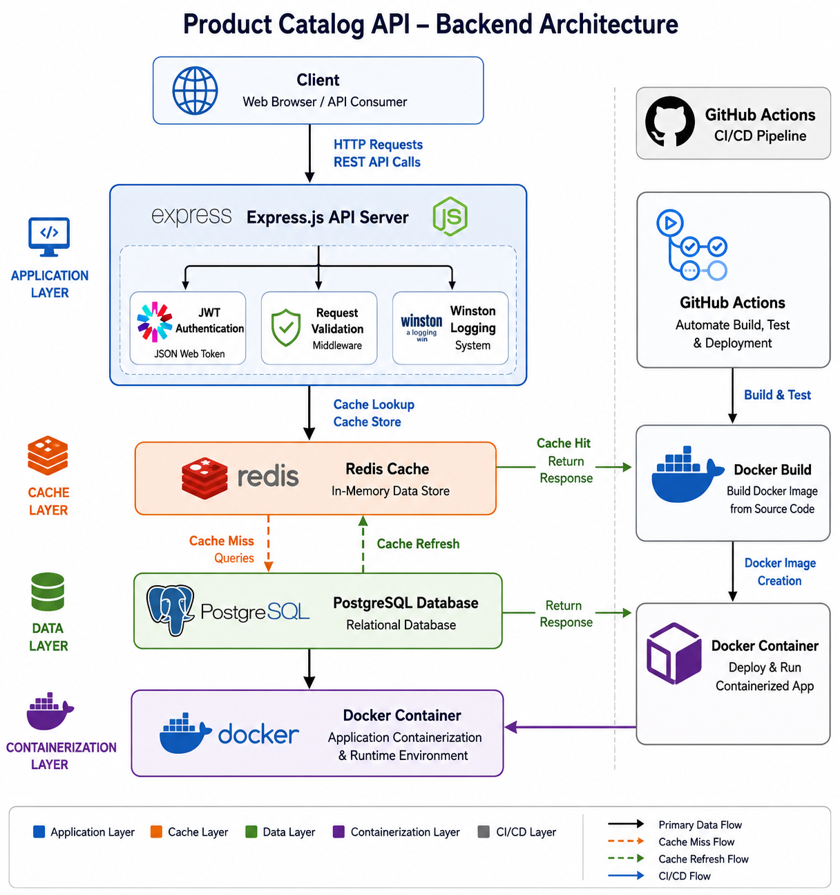
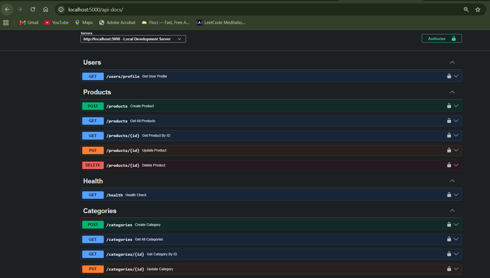
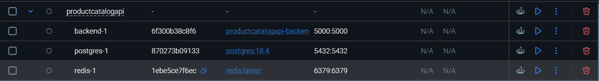
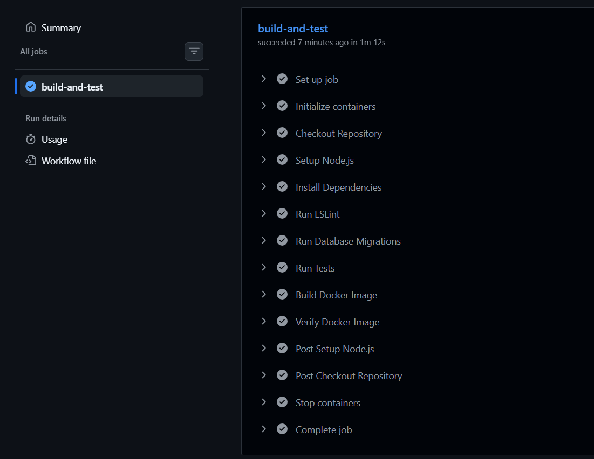

# Product Catalog API

A production-ready backend REST API built using Node.js, Express.js, PostgreSQL, Redis, Docker, and GitHub Actions, demonstrating modern backend engineering practices such as authentication, authorization, caching, rate limiting, logging, testing, containerization, and continuous integration.

---

## Overview

This project simulates a real-world Product Catalog Management System where authenticated users can interact with products and categories while administrators manage resources securely.

The application follows a layered architecture and incorporates industry-standard backend practices including:

* JWT Authentication
* Role-Based Access Control (RBAC)
* PostgreSQL Database Integration
* Redis Caching
* Redis-Based Rate Limiting
* Structured Logging with Winston
* Swagger/OpenAPI Documentation
* Automated Testing using Jest & Supertest
* Docker Containerization
* GitHub Actions CI Pipeline

---

## Architecture Diagram

Add image:



---

## Features

### Authentication & Authorization

* User Registration
* User Login
* JWT-Based Authentication
* Password Hashing using bcrypt
* Protected Routes
* Role-Based Access Control (Admin/User)

### Product Management

* Create Product
* Get All Products
* Get Product By ID
* Update Product
* Delete Product

### Category Management

* Create Category
* Get Categories
* Get Category By ID
* Update Category
* Delete Category

### Database Features

* PostgreSQL Relational Database
* Foreign Key Relationships
* Connection Pooling
* Pagination
* Searching
* Filtering
* Sorting
* Database Indexing

### Redis Features

* Cache-Aside Pattern
* Product Endpoint Caching
* Automatic Cache Expiration
* Cache Invalidation on Data Updates

### Security Features

* JWT Authentication
* Password Hashing
* Request Validation
* Role-Based Access Control
* Redis Rate Limiting
* Environment Variable Configuration

### Observability

* Structured Logging with Winston
* Request Logging
* Error Logging
* Centralized Error Handling

### Documentation

* Interactive Swagger UI
* OpenAPI Specification
* Request/Response Examples

### Testing

* Jest Test Framework
* Supertest API Testing
* Authentication Tests
* Product API Tests
* Category API Tests
* Middleware Tests

### DevOps

* Docker
* Docker Compose
* Multi-Service Containers
* GitHub Actions Continuous Integration

---

## Tech Stack

### Backend

* Node.js
* Express.js

### Database

* PostgreSQL

### Caching

* Redis

### Authentication

* JWT
* bcrypt

### Documentation

* Swagger/OpenAPI

### Testing

* Jest
* Supertest

### Logging

* Winston

### DevOps

* Docker
* Docker Compose
* GitHub Actions

---

## Project Structure

```text
src/
├── config/
├── controllers/
├── middleware/
├── repositories/
├── routes/
├── services/
├── tests/
├── utils/
└── app.js

migrations/
docker/
logs/
.github/
└── workflows/
```

---

## API Endpoints

### Health Check

```http
GET /health
```

### Authentication

```http
POST /auth/register
POST /auth/login
```

### User

```http
GET /users/profile
```

### Products

```http
POST   /products
GET    /products
GET    /products/:id
PUT    /products/:id
DELETE /products/:id
```

### Categories

```http
POST   /categories
GET    /categories
GET    /categories/:id
PUT    /categories/:id
DELETE /categories/:id
```

---

## API Documentation

Swagger UI is available at:

```text
http://localhost:5000/api-docs
```

The documentation includes:

* Endpoint Descriptions
* Request Schemas
* Response Schemas
* Authentication Requirements
* Error Responses

---

## Environment Variables

Create a `.env` file in the project root.

```env
PORT=5000

DB_HOST=localhost
DB_PORT=5432
DB_NAME=product_catalog
DB_USER=postgres
DB_PASSWORD=password

REDIS_URL=redis://localhost:6379

JWT_SECRET=your_secret_key
JWT_EXPIRES_IN=1d
```

---

## Local Installation

### Clone Repository

```bash
git clone https://github.com/yourusername/product-catalog-api.git

cd product-catalog-api
```

### Install Dependencies

```bash
npm install
```

### Configure Environment Variables

Create `.env`

### Run Database Migrations

```bash
npm run migrate
```

### Start Development Server

```bash
npm run dev
```

Server:

```text
http://localhost:5000
```

---

## Running Tests

Run all tests:

```bash
npm test
```

Run coverage report:

```bash
npm run test:coverage
```

Expected coverage target:

```text
70%+
```

---

## Redis Caching

Implemented using Cache-Aside Pattern.

Flow:

```text
Request
   │
   ▼
Redis Cache
   │
   ├── Cache Hit
   │      │
   │      ▼
   │   Return Response
   │
   └── Cache Miss
           │
           ▼
      PostgreSQL
           │
           ▼
      Store Cache
           │
           ▼
      Return Response
```

Cached Endpoints:

```text
GET /products
GET /products/:id
```

Cache TTL:

```text
300 Seconds
```

---

## Rate Limiting

Implemented using Redis.

Limit:

```text
100 Requests / Minute / IP
```

Response:

```json
{
  "message": "Too Many Requests"
}
```

---

## Docker

### Build Containers

```bash
docker compose build
```

### Start Services

```bash
docker compose up
```

Services:

* Backend API
* PostgreSQL
* Redis

### Verify Running Containers

```bash
docker ps
```

---

## CI Pipeline

GitHub Actions automatically performs:

* Dependency Installation
* Linting
* Automated Testing
* Application Build
* Docker Image Build Verification

Pipeline executes on:

```text
Push
Pull Request
```

---

## Sample Response

### Health Endpoint

```json
{
  "status": "healthy",
  "service": "product-catalog-api"
}
```

---

## Screenshots

### Swagger Documentation



### Docker Containers



### GitHub Actions CI



---

## Skills Demonstrated

* Backend Development
* REST API Design
* PostgreSQL
* Redis
* Authentication & Authorization
* Role-Based Access Control
* Caching Strategies
* Rate Limiting
* Logging & Observability
* API Documentation
* Automated Testing
* Docker Containerization
* Continuous Integration
* Production-Oriented Backend Architecture

---

## Future Improvements

* Kubernetes Deployment
* AWS ECS Fargate Deployment
* AWS ElastiCache Integration
* AWS RDS PostgreSQL
* Prometheus Monitoring
* Grafana Dashboards
* Distributed Tracing
* GitHub Actions CD Pipeline

---

## Author

Viraj Solanki

B.Tech Computer Engineering

Cloud Engineering & DevOps Enthusiast
